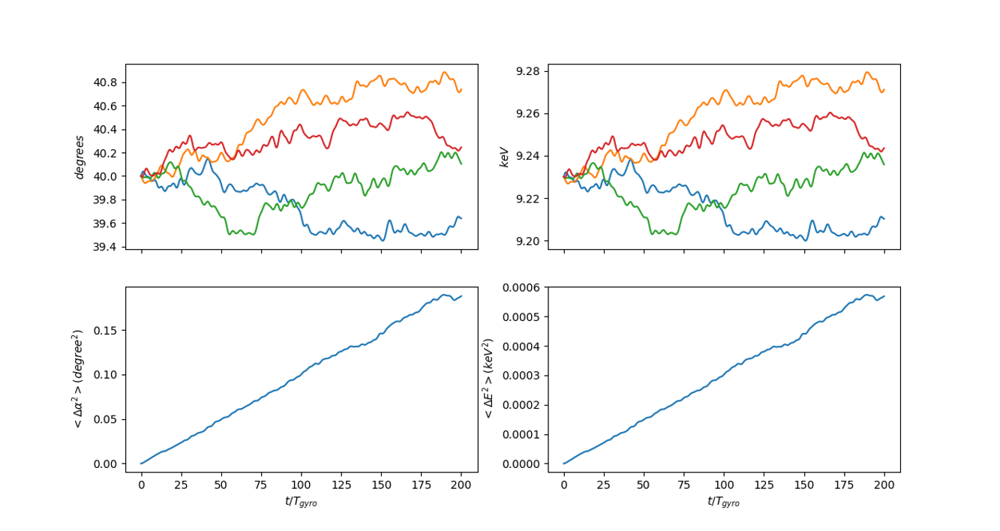

 taiparticle-uniform

A test particle code using Taichi framework.

This code can reproduce the study of https://agupubs.onlinelibrary.wiley.com/doi/full/10.1029/2011GL046787

## About Taichi
Taichi (https://www.taichi-lang.org/) is a high performance programming framework in python. The code can run on any device with automatically parallization.
When installing taichi, remember to install the nightly version:
'''
pip install -i https://pypi.taichi.graphics/simple/ taichi-nightly
'''
This is due to an issue I contributed: https://github.com/taichi-dev/taichi/issues/7255
This is fixed but has not been released by the taichi 1.4.1

An example of how to run the model is in batch_run.py

Update: A paper is published: https://doi.org/10.3389/fspas.2024.1332931 !

A version in dipole field can be found at https://github.com/donglai96/taiparticle-dipole
An oblique version can be found at https://github.com/donglai96/taiow2
